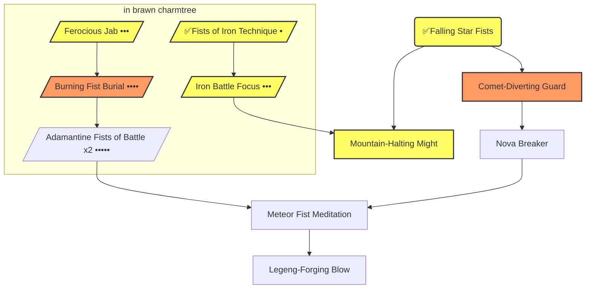

## Description
### Artefact (Heaven and Earth Gauntlets)
 артефакт 3 (Heaven and Earth Gauntlets // Orichalcum Smashfists, Artifact •••) 

> [!NOTE] [[Ex3 Arms of the Chosen.pdf#page=36&selection=238,0,313,22|Arms of the Chosen, p.35-36]]
>Orichalcum Smashfists, Artifact •••
> Attunement: 5m
> Type: Light (+5 ACC, +10 DMG, +0 DEF, OVW 3)
> Tags: Bashing, Brawl, Grappling, Smashing, Worn
> Hearthstone slot(s): 2
> Era: Broken Blade Concordat
> [[Сумирэ, Лиловая Жемчужина#Arms of Chosen book]]

Light (Accuracy +5, DMG +10, DEF +0, *OVW* 3)  
Tags:
*Bashing* (тип урона для решающих атак), 
*Brawl* (навык для атаки), 
**Grappling** (подходит для гамбитов захвата), 
*Smashing* (пожертвуй 1 защиту и потрать 2 ед. инициативы; при успехе опрокинь врага или оттолкни его на 1 зону прочь), 
*Worn* (снятие и надевание считается за действие, надетые считаются естественным оружием - нельзя разоружить, и оно всегда готово)

#### Эвокации
**Falling Star Fists** (Cost: 5m; Essence 1, Supplemental, Instant, Keywords: Dual (для обоих типов атак))
Striking with overwhelming force, the Heaven and Earth Gauntlets clear the battlefield of foes. This Evocation *waives the Initiative cost and Defense penalty for making a **smash** attack* (Exalted, p. 586). The wielder adds (Strength) bonus dice to a withering smash attack’s raw damage, or doubles 10s on a decisive smash attack’s damage roll 
> +4(СИЛА) бонусных кубика в сырой пул урона ослабляющей атаки
> или двойные десятки в броске урона решающей атаки

## History
