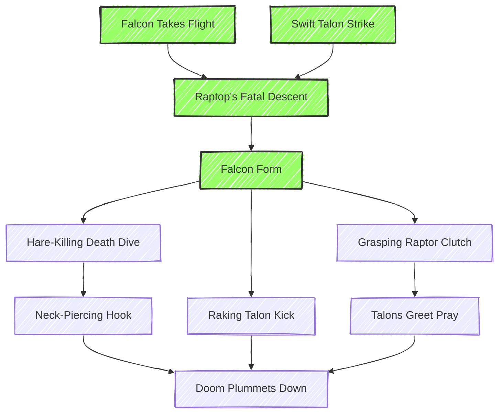
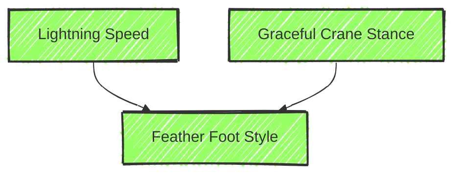
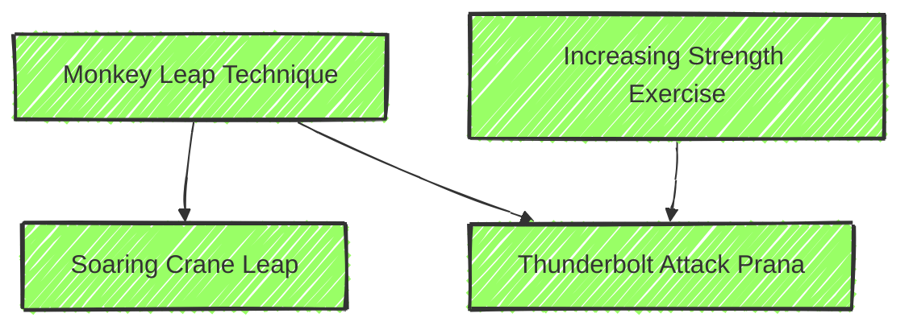

---
{}
---
  #1-Сторителл/Exalted/солар #1-Сторителл/чарник

# Нарратив

> [!NOTE] концепция
> Банг Шишигами из файтинга BlazBlue. Ниндзя "Воин Любви и Справедливости"
> https://blazblue.wiki/wiki/BlazBlue_Alternative:_Dark_War

*Рождение/происхождение*: 33 года (~735 ГЦ рождения), сын кузнеца из Лукши (Конфедерация Рек)
*Текущая принадлежность (страна, фракция, группа)*: наемный отряд "Годай" (Великая Пятерка => пять колец) размером с коготь (125)
*Был возвышен:* 2-3 года назад

## Близости и Предел
(defining principle -3/+4) Воин Любви и Справедливости
(major tie -2/+3) Команда Ниндзя
(minor tie -1/+2) Соперник "Кисараги"
(minor principle -1/+2) Противостояние Царству

Прорыв предела: он видит страдания невинных и не может или не хочет помочь им.
Накопление предела `[ ][ ][ ][ ][ ] [ ][ ][ ][ ][ ]` 
## Каста Рассвета
*Ассоциации*: Сезон весны, полнолуние, Дева Битвы, цвета лаванды и шафрана, Восток, стихия Огня. 
*Прозвища*: Восходящие солнца, Дети рассвета, Светоносцы, Копья утра, Небесные мечи, Бронзовые тигры, Отреченные (уничижительное).
*Знамя Анимы*: Знак касты Рассвета — восьмиконечный солнечный луч из чистого золота, сверкающий на челе. Знамена анимы касты Рассвета часто бывают бледно-золотыми или белыми, с розово-красными и едва заметными фиолетовыми оттенками — цветами восхода солнца.
# Игромеханика

> [!warning] ОТРЕЧЕННЫЕ
> 
> В баснях Непорочных каста Рассвета была самой жестокой и свирепой из Анафем. Эти  чудовища служили испещренным перчатками кулаком богохульной гегемонии своих собратьев. Когда против этой тирании восстали стойкие Драконокровные, остальные Анафемы бросили своих воинов-дуболомов, оставив их умирать. В память об этом предательстве Анафемы навсегда стали называться Отреченными.

## Анима Рассвета
**Эффекты Анимы**: В древности Непокоренное Солнце был военным вождем богов, и его свирепость живет в сущности каждой касты Рассвета, оттачивая их и без того недюжинное боевое мастерство до непревзойденного совершенства. 
- При повторном наборе базовой Инициативы после успешной решающей атаки, если анима на уровне костра/иконической анимы, Рассвет добавляет к своей базовой Инициативе половину рейтинга Эссенции (округлите в большую сторону).
- За 10 частиц, все Боевые Чармы и Чармы Передвижения Рассвета с невыполненными условиями сброса автоматически сбрасываются. Этот эффект можно использовать только один раз в день, он становится снова доступен на рассвете.
- Каста Рассвета вселяет ужас в своих врагов. Она добавляет половину своего показателя Эссенции (округлите в большую сторону) в кубиках ко всем устрашающим социальным воздействиям. Она также может запугивать цели, которые не чувствуют страха, например автоматов, големов и некоторую нежить.

Введя в свою аниму частицу эссенции, все солары могут вызывать следующие эффекты:
• Солар может ощущать яркое присутствие солнца относительно себя и таким образом узнавать точное время суток. Это работает, даже если она находится под землей или в Вильде за пределами Творения.
• Солар может заставить свой знак касты проявиться и показывать себя столько, сколько пожелает.

## Атрибуты
Базовых очков: 8/6/4. Бонусных: +1 стамина (4)

Физика (первичные)
	СИЛ 4
	ЛОВ 4
	ВЫН 4

Социалка (третичные)
	ХАР 3
	МАН 1
	ВНШ 3

Менталка (вторичные)
	ВОС 4
	ИНТ 2
	СМК 3
	
## Способности 
Базовых очков: 28. Бонусных:  8 = 4 на каст/избр

| C/S/F | Ability            | Навык                   | рейтинг | трата очков |
| :---: | ------------------ | ----------------------- | :-----: | ----------- |
|       | Archery            | Стрельба                |         |             |
|   f   | *Athletics*        | Атлетика                |    3    |             |
|   c   | **Awareness**      | Бдительность            |    3    |             |
|   c   | **Brawl**          | Драка                   |    1    |             |
|       | Bureaucracy        | Бюрократия              |         |             |
|       | Craft              | Ремесло                 |         |             |
|   f   | *Dodge*            | <u>Уклонение</u>        |    3    |             |
|   f   | *Integrity*        | Целостность             |    3    |             |
|       | Investigate        | Расследование           |         |             |
|       | Larceny            | Кража                   |         |             |
|       | Linguistics        | Лингвистика             |         |             |
|       | Lore               | Знания                  |         |             |
|   S   | ***Martial Arts*** | <u>Боевые искусства</u> |    5    | 3+2b        |
|       | Medicine           | Медицина                |         |             |
|       | Melee              | Ближний бой             |         |             |
|       | **Occult**         | Оккультизм              |         |             |
|       | Performance        | Выступление             |         |             |
|   f   | *Presence*         | <u>Присутствие</u>      |    3    |             |
|   c   | **Resistance**     | Сопротивление           |    3    |             |
|       | Ride               | Верховая езда           |         |             |
|       | Sail               | Парус. плавание         |         |             |
|       | Socialize          | Социализация            |         |             |
|   f   | *Stealth*          | Скрытность              |    3    | 1+2b        |
|       | Survival           | Выживание               |    1    |             |
|   c   | **Thrown**         | Метание                 |    2    |             |
|   c   | **War**            | <u>Война</u>            |    2    |             |
Специализации:
- Уклонение (от дальних атак)
- Присутствие (вдохновлять)
- Война (разведка, диверсия)
- Под-навык Боевые Искусства (Стиль Сокола)

## Достоинства
- Resources 1
- *Language 1
	Dragontoungue (а родной - Riverspeak)*
- Fast Reflexes 3 (Purchased)
	- Tempered by war or perhaps by growing up living on the edge, the character’s steady nerves give him an advantage in battle. He ==adds one additional die to Join Battle roll==
- Command 3 (Story)
	- The character is the recognized commander of an organized military force of some sort—generally one composed of ordinary mortal soldiers (traits for an average soldier can be found on p. 496). This Merit’s rating determines how great a force the character commands. For more information on battle groups, see pages 205-211.
	- Battle Group of Size 3, Might 0 with Elite Drill 
	- https://colin-fredericks.github.io/ex3-battle-groups/
> [!example]- **Battle-Ready Troops** (3/0/Elite)  ^fe9661
Size: 1 (dozen: 1-4 клыка), 2 (промежуточный 1-4 чешуи), 3 (полный ЧВК, коготь)
Join Battle: 6
==Attack== (Chopping sword): accuracy 7+[size], damage 12+[size] min. 2
==Attack== (Long spear): accuracy 5+[size], damage 14+[size]
==Attack== (Shield bash): accuracy 6+[size], damage 12+[size]
Defense: 6
==Magnitude==: 7+[size]
==Soak==: 8+[size]
Senses: 4
Resolve: 2
Resist: 2
Command Bonus: 2
Rout Difficulty: 1 ^cb4239

- Martial Artist 4 (Purchased)
	- The character has undergone systematic training in at least one formal combat art. Perhaps she was raised as an Immaculate monk, or studied in a dojo during her journeys. This Merit allows the character to purchase the Martial Arts Ability.
### Artefact (Heaven and Earth Gauntlets)
- Сюжетно, когда сыграем флешбек:
	- артефакт 3 (Heaven and Earth Gauntlets // Orichalcum Smashfists, Artifact •••) 

> [!NOTE] [[Ex3 Arms of the Chosen.pdf#page=36&selection=238,0,313,22|Arms of the Chosen, p.35-36]]
>Orichalcum Smashfists, Artifact •••
> Attunement: 5m
> Type: Light (+5 ACC, +10 DMG, +0 DEF, OVW 3)
> Tags: Bashing, Brawl, Grappling, Smashing, Worn
> Hearthstone slot(s): 2
> Era: Broken Blade Concordat
> [[0. Вся история Лиловой Жемчужины#Arms of Chosen book]]

 

## Чармы
Чармы (15 шт)
Получение Превосходств: автоматически за кастовые и избранные способности с 1+ точкой, или способность с хотя бы одним чармом. 
> [!NOTE]- Чары Превосходства
> Усилить бросок: 1 мот за каждый добавленный кубик. Instant, Supplemental.
> Усилить статичное значение: 2 мота за каждый +1 к числу. Instant, Reflexive.
> В обоих случаях трата мотов до максимума (Атрибут+Способность) с учетом обычных ограничений на добавление кубиков к броску с помощью магии.
> Все использование Превосходства длится мгновенно. Если Превосходство используется для усиления броска кубиков, оно считается дополнительным действием (supplemental). Если оно используется для защиты, оно считается рефлексивным (reflexive).

==Кастовые== (Боевые Искусства, Осознание, Драка, Сопротивление, Метание, Война)
- 4 Боевые Искусства (Стиль Сокола)
	- Falcon Takes Flight+Swift Talon Strike => Raptor’s Fatal Descent => **Falcon Form**
- 1 Война
	- Ideal Battle Knowledge Prana  
- 1 Драка
	- Fists of Iron Technique

==Избранные== (Атлетика, Уклонение, Целостность, Присутствие, Скрытность)
- 7 Атлетика
	- Graceful Crane Stance + Lightning Speed   =>   Feather Foot Style 
	- Monkey Leap Technique    =>   Soaring Crane Leap 
	- (mlt)+Increasing Strength Exercise   =>   Thunderbolt Attack Prana  
- 1 Уклонение
	-  Drifting Leaf Elusion 
- 1 Скрытность
	- Blinding Battle Feint ^756578
### Боевые искусства (Стиль Сокола)

Falcon Style ([[Lunars Fangs at the Gate.pdf]], p. 300): Dexterity style focused on mobility, grapples, throws and elevation
> [!tip]- Falcon Style Charm Cascade PDF
> ![[falcon style charm tree.pdf]]

 Falcon style is a high-flying art, its practitioners leaping across the battlefield as they deliver powerful strikes or seek out elevated vantages from which to deliver the finishing blow. In addition to attacks executed in midair, the style makes heavy use of grappling, locking enemies into painful submission holds or throwing them to the ground before executing a punishing follow-up.
	 Weapons: • **Unarmed** • Tiger Claws • **Iron Boots** • Cestus
	 Armor: Light armor only.

Charms:
- **Falcon Takes Flight** - bonus to disengage, rush or rise from prone, can move away from an enemy after attacking
- **Swift Talon Strike** - bonus to attack and grapple after moving towards an enemy
- **Raptor’s Fatal Descent** - bonus to decisive damage against prone enemies, lower enemy Initiative
- **Falcon Form** - bonus to grapple, bonus to jumping and falling, bonus Defence against non-ranged, non-reaching attacks
- Grasping Raptor Clutch - in grapple, after a restrain or drag action make a decisive savaging attack
- Talons Greet Prey - bonus Defence against a close range attack, counterattack with a grapple on a miss
- Hare-Killing Death Dive - bonus to grapple, knock clinched enemies prone and steal their initiative
- Neck-Piercing Hook - throw a grappled enemy to a short / medium range
- Raking Talon Kick - bonus to a decisive attack against a thrown or slammed enemy
- Doom Plummets Down - throw a hard grappled enemy and do a decisive attack against them

### Атлетика

     
# Параметры
**Эссенция = 1**
**личный запас эссенции** 13
**периферийный запас эссенции** 33
Состояние анимы (за 5+ одновременно потраченных искр периферии):
- [ ] dim - на нуле
- [ ] glow - стелс и маскировка получают штраф в -3
- [ ] burn - стелс невозможен. Остаются физические улики.
- [ ] bonfire\iconic - дает свет на коротком расстоянии.
Угасание: icon->15min burn->15min glow->30min dim
восстановление искр: в конце своего раунда +5; вне боя +5 в час; сначала периферия.

**здоровье**: 0 [ ] -1 [ ] -1 [ ] -2 [ ] -2 [ ] -4 [ ] Н/Д
**сила воли** 7/7

Soak: 7 = 4(stamina)+3(armor)+?charms

Defense: 
	Parry     5=(dex+M.Arts)/2 + weapDEF 
	Evasion 4=(dex+dodge)/2 - armorMP

Movement: 
	Rush          7=dex+athletics
	Disengage 7=dex+dodge

Social:
	Resolve 3=(wits+integrity+spec)/2
	Guile     1=(man+socialize+spec)/2

# Предметы
- ==Железные ботинки==:
Light (Accuracy +4, DMG +7, DEF +0,  *Overwhelming*[^1] 1 )  
attack withering dex+skill+acc+spec=14; decisive=dex+skill+spec?=10
Tags: *Bashing* (тип урона для решающих атак), *Brawl/MA* (навык для атаки), *Smashing* (пожертвуй 1 защиту и потрать 2 ед. инициативы; при успехе опрокинь врага или оттолкни его на 1 зону прочь), *Worn* (снятие и надевание считается за действие, надетые считаются естественным оружием - нельзя разоружить, и оно всегда готово)
- ==Легкая броня==:
Light (Soak +3, Hard 0, MP 0)
- ==(Позже) Перчатки Земли и Небес==
Light (Accuracy +5, DMG +10, DEF +0, *OVW* 3)  
Tags: *Bashing* (тип урона для решающих атак), *Brawl* (навык для атаки), **Grappling** (подходит для гамбитов захвата), *Smashing* (пожертвуй 1 защиту и потрать 2 ед. инициативы; при успехе опрокинь врага или оттолкни его на 1 зону прочь), *Worn* (снятие и надевание считается за действие, надетые считаются естественным оружием - нельзя разоружить, и оно всегда готово)

[^1]: overwhelmimg - количество минимального урона изнуряющей атаки, который пройдет поверх поглощения (soak). То есть поглощение цели не может снизить урон ниже OVW
# Траты опыта
Распределение бонусных (15)
- Атрибуты 4
- Навыки 4
- Воля 4
- Достоинство 1
- Специализация 1