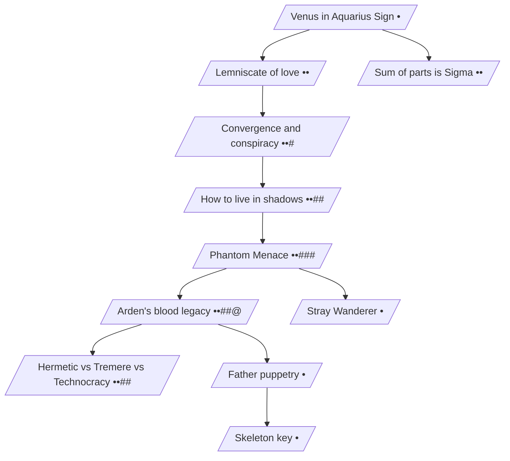

---
aliases:
  - мини
  - гет
  - миди
  - рейтинг
tags:
  - a/neurofic
topics:
  - маги
  - уравнение хаоса
🔮actors:
  - "[[Рене Сериз Дюбуа]]"
  - "[[Ирэнэ Вайсс]]"
  - "[[Дитрих Эрхард бани Фортунэ]]"
🔮chronology:
🔮lastdate: 2015-05-19
vaultpart: нейротворчество
---
1. [[01 Венера в Водолее]]
2. [[02.1 Лемниската любви (Марвин)]] - если влюбленный студент станет адептом вместе с Вилли
	1. [[02.2 Заговоры и заклятья]] - интриги вокруг Марвина и Вилли
	2. [[02.3 Уроки теней]] - обучение новых адептов и защита их от Технов
		1. [[02.3а Альт версия - сплетни под пивасик]] - адепты сплетничают о Рене
	3. [[02.40 Новая угроза]] - Технократы Вольфганга начали копать под Поля Ардена
		1. [[02.410 Наследие Арден]] - семья Арден оказывается связана с кланом Тремер
			1. [[02.411 Информационные войны]] - технократы, Тремер, кабал и Дитрих начинают множественную инфовойну. Поль оказывается в заложниках у вампира
			2. [[02.412 Игра теней за спиной отца]] - кабал давит на отца Поля и Моны, чтобы дотянуться до вампиров
			3. [[02.4121 Ключ и склеп]] - кабал выясняет, что семья Арден интересовала и других вампиров-магов - некромантов Джованни. Хрупкий союз с ними и - внезапно - с Арно Боррелем- позволяет спасти Поля, раскрыть тайны Арден и отбросить планы Тремер.
		2. [[02.420 Калеб, Странник Дорог]] - Поль оказывается подменышем-Эшу. Воссоединение брата и сестры в Париже/Гамбурге и побитие ими полевых агентов Технократии. Добрые семейные сцены.
3. [[03.1 Больше чем слагаемые (Леонард)]] - если влюбленный студент Пробудится сам. Без глобального сюжета для кабала

